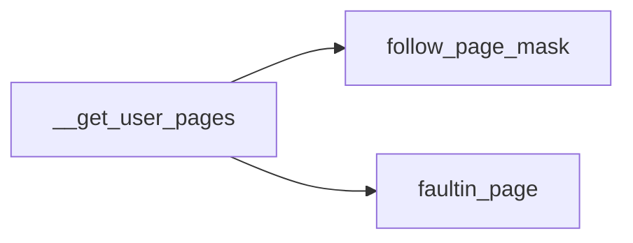
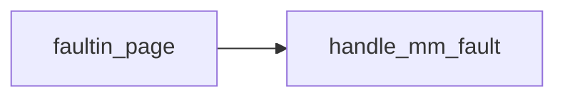

# 漏洞描述

Dirty COW漏洞，可以实现Linux内核本地提权。Linux内存子系统在处理copy-on-write时存在条件竞争漏洞，存在于多个Linux版本中，影响所有的Linux发行版。

利用dirtycow对于vDSO的破解可以实现容器的逃逸，同时可以使用相同的方法进行本地提权。

# 漏洞详情
## 背景知识

### COPY-ON-WRITE

**1. get_user_pages**

一个包装函数，会调用`__get_user_pages`

```c
get_user_pages{//这是一个Wrap
    ...
    return __get_user_pages() //获取用户内存的核心函数
    ...
}
```

**2.  __get_user_pages**



```c
__get_user_pages(vma,...,int flag,...){
    ...
    retry:
        ...
        page = follow_page_mask(...,flag,...); //获取页表项
       if (!page) {
            int ret;
            ret = faultin_page(vma,...); //获取失败时会调用这个函数
            switch (ret) {
               case 0://如果返回为0，就重试，这是一个循环
               goto retry;
            ...
            
        }
}
```

尝试通过调用`follow_page_mask`获取页表项，如果失败则会调用`faultin_page`处理失败

**3. follow_page_mask**

```c
follow_page_mask(...,flag,...){
    //这个函数会走 页一集目录->二级目录->页表项 的传统页式内存的管理流程
    ...
    return follow_page_pte(...,flag,...); //走到了流程的第三步：寻找页表项
    ...
}
```
常规的寻址流程，按照层次逐层的寻找页表项，最后一层会调用到`follow_page_pte`

**4. follow_page_pte**

```c
follow_page_pte(...,flag,...){
    ...
    //如果获取页表项时要求页表项所指向的内存映射具有写权限，但是页表项所指向的内存并没有写权限。则会返回空
    if ((flags & FOLL_WRITE) && !pte_write(pte)) { 
       pte_unmap_unlock(ptep, ptl);
       return NULL;
    }
    //获取页表项的请求不要求内存映射具有写权限的话会返回页表项
    return pages;
    ...
}
```

最后会进行权限的检查，当出现这种情况：“要求获取页表项所指向的内存具有写权限（`flags & FOLL_WRITE`）但是页表项所指向的内存没有写权限时（`!pte_write(pte)`）”，返回NULL。否则返回页表项。

如果返回了空，那么几个函数返回后控制流将转移到`faultin_page`

**5. faultin_page**




```c
faultin_page(vma,){
    ...
    //处理page fault
    ret = handle_mm_fault();
    //这个if对应了上一个函数的注释，如果是因为映射没有写权限导致的获取页表项失败，会去掉flags中的FOLL_WRITE标记，从而使的获取页表项不再要求内存映射具有写的权限。
    if ((ret & VM_FAULT_WRITE) && !(vma->vm_flags & VM_WRITE))
       *flags &= ~FOLL_WRITE;
    ...
    return 0；
}
```

首先调用`handle_mm_fault`处理页错误，然后会根据页错误的原因进行处理：

如果是因为没有写权限导致的获取页表项失败，则会去掉flag中的`FOLL_WRITE`位。

**6. handle_mm_fault**

```c
handle_mm_fault(){
    __handle_mm_fault()
}
__handle_mm_fault(){
    handle_pte_fault()
}
```
调用了`handle_pte_fault`

**7. handle_pte_fault**
```c
handle_pte_fault(){
    //页表为空，说明缺页。调用do_fault调页
    if (!fe->pte) {
          ... 
         return do_fault(fe);
   }
   //页表不为空，但是要写入的页没有写权限，这时可能需要COW
   if (fe->flags & FAULT_FLAG_WRITE) {
        if (!pte_write(entry))
            return do_wp_page(fe, entry);
        ...
    }
}
```
在这个函数处理多种错误：
1. 页表为空，需要调页，调用`do_fault`处理
2. 页表不为空，但是没有写入权限，调用`do_wp_page`处理

**8. do_fault**
处理缺页，需要进行调页

```c
do_fault(fe){
    //如果不要求目标内存具有写权限时导致缺页，内核不会执行COW操作产生副本
    if (!(fe->flags & FAULT_FLAG_WRITE))
        return do_read_fault(fe, pgoff);
    //如果要求目标内存具有写权限时导致缺页，目标内存映射是一个VM_PRIVATE的映射，内核会执行COW操作产生副本
    if (!(vma->vm_flags & VM_SHARED))
        return do_cow_fault(fe, pgoff);
}
```

根据flag会执行不同操作：
1. 如果不要求目标内存具有写权限时导致缺页(`!(fe->flags & FAULT_FLAG_WRITE)`)，调用`do_read_fault`处理缺页
2. 如果不是VM_SHARED映射，也就是说是VM_PRIVATE映射时(`!(vma->vm_flags & VM_SHARED)`)，调用`do_cow_fault`使用写时复制调页

**9. do_cow_fault**

```c
do_cow_fault(fe,pgoff){
    //执行COW， 并更新页表为COW后的页表。
    new_page = alloc_page_vma(GFP_HIGHUSER_MOVABLE, vma, fe->address);
    ...
    // __do_fault会将内存
    ret = __do_fault(fe, pgoff, new_page, &fault_page, &fault_entry);
    ... 
        copy_user_highpage(new_page, fault_page, fe->address, vma);
    ret |= alloc_set_pte(fe, memcg, new_page);
    ...
    return ret
}
```

申请内存，复制，以实现写时复制

**10. do_read_fault**

```c
do_read_fault(fe,pgoff){
    ...
    //不执行COW，直接映射文件。
    __do_fault(fe, pgoff, NULL, &fault_page, NULL);
    ...
    ret |= alloc_set_pte(fe, NULL, fault_page);
    ...
    ret
}
```
无需写时复制，直接映射

**11. alloc_set_pte**
```c
alloc_set_pte(fe,...){
    bool write = fe->flags & FAULT_FLAG_WRITE;
    //如果执行了COW，设置页表时会将页面标记为脏，但是不会标记为可写。
    if (write)
        entry = maybe_mkwrite(pte_mkdirty(entry), vma);
}
```

标记为dirty

**12. do_wp_page**

```c
do_wp_page(fe,entry){
     ....
     //内核通过检查，发现COW操作已经在缺页处理时完成了，所以不再进行COW，而是直接利用之前COW得到的页表项
     return wp_page_reuse(fe, orig_pte, old_page, 0, 0);
}
```

已经进行过COW了，不需进行

**13. wp_page_reuse**
```c
wp_page_reuse(){
     //将页面标记为脏，但是不会标记为可写。
     entry = maybe_mkwrite(pte_mkdirty(entry), vma);
}
```
将页面标记为dirty，但是不会标记为可写

**14. maybe_mkwrite**
```c
maybe_mkwrite(){
    //这就是maybe_mkwrite不会标记页为可写的原因，因为这个页为只读页。所以不满足if的条件
    if (likely(vma->vm_flags & VM_WRITE))
        pte = pte_mkwrite(pte);
    return pte;
}
```

注意到if语句，由于`vma->vm_flags & VM_WRITE`为否，所以不会设置为可写。

### `madvise`
`madvise`是dirtycow漏洞利用的核心

```c
#include <sys/mman.h>
int madvise(void *addr, size_t length, int advice);
```

系统调用，通知内核 [ addr,addr+length ] 这段内存空间接下来的使用状况，当advise参数为`MADV_DONTNEED`时：

> Do  not  expect access in the near future.  (For the time being,the application is finished with the given range, so the  kernel can free resources associated with it.) 

> After  a  successful  MADV_DONTNEED  operation, the semantics of memory access in the specified region  are  changed:  subsequent accesses  of pages in the range will succeed, but will result in either repopulating the memory contents from the up-to-date con�\tents  of  the underlying mapped file (for shared file mappings, shared anonymous mappings, and shmem-based  techniques  such  as System  V  shared  memory segments) or zero-fill-on-demand pages for anonymous private mappings. Note that, when applied to shared mappings, MADV_DONTNEED  might not  lead  to  immediate freeing of the pages in the range.  The kernel is free to delay freeing the pages until  an  appropriate moment. The resident set size (RSS) of the calling process will be immediately reduced however.

# 漏洞利用

## 背景知识

### vDSO
vDSO(virtual dynamic shared object)是一个共享库，内核会将其加载到所有进程的用户地址空间中。vDSO主要解决一些时间敏感的系统调用调用时间过长的问题，这些系统调用返回的信息通常也不敏感，所以将其实现在用户地址空间内。

**使用方法：**
通过如下代码获取此进程vDSO在用户内存空间的地址
```c
#include <sys/auxv.h>
void *vdso = (uintptr_t) getauxval(AT_SYSINFO_EHDR);
```

利用Dirty COW将payload写入到vDSO内存范围内，当有root进程调用vDSO地址空间的函数时，注入的shellcode将会被执行。在root进程空间内会反弹一个shell到指定的IP地址和端口中。

### dirtyCOW利用

DirtyCOW是典型的条件竞争漏洞，整体的利用思路如下：

- 创建两个线程
- 线程1不断执行madvise系统调用，将vdso地址空间标记为`MADV_DONTNEED`
- 线程2则利用ptrace向被调试进程的地址空间写入shellcode，正常情况下会导致写时复制，但是由于条件竞争漏洞，可能会写到对应的内存中。

# 漏洞复现

## 环境搭建
```
sudo ./metarget cnv install cve-2016-5195
docker build -t dirtycow .
docker run -it -p 1234:1234 --cap-add=SYS_PTRACE dirtycow
```
EXP代码使用了PTRACE进行代码注入，但是docker默认过滤了`CAP_SYS_PTRACE`。

# 参考链接
1. [Dirty COW - (CVE-2016-5195) - Docker Container Escape](https://blog.paranoidsoftware.com/dirty-cow-cve-2016-5195-docker-container-escape/)