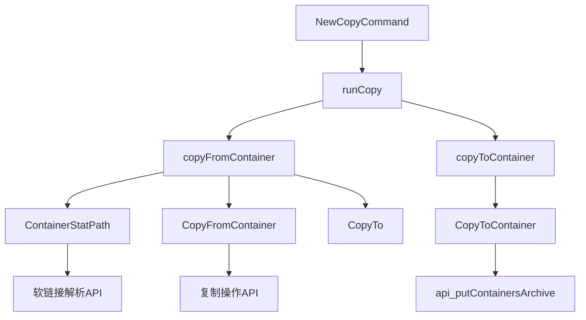
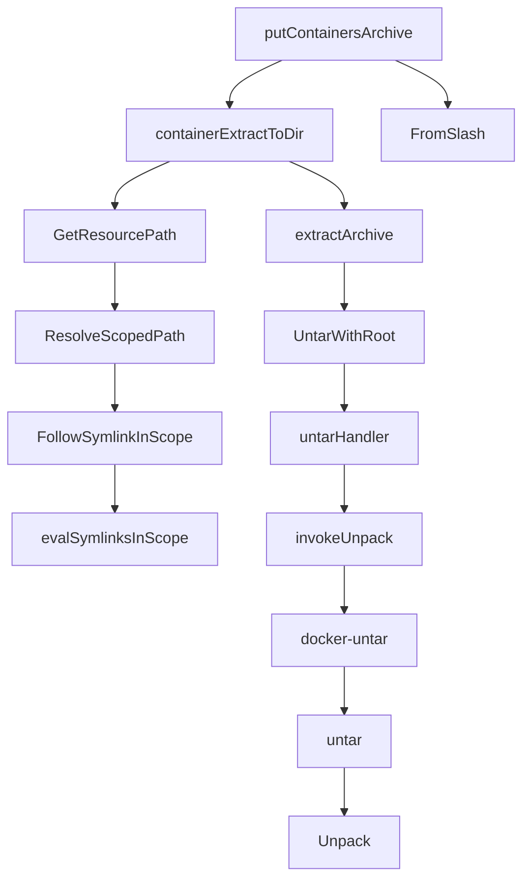

# CVE-2018-15664

利用该漏洞攻击者可以实现容器的逃逸，访问host中的文件。这是一个逻辑漏洞，攻击者可以通过构造恶意的软链接以获得host上文件的读写权限。

## 影响范围

Docker 18.06前的全部版本，CVSS 3.X评分为7.5

## 漏洞分析

首先获取有漏洞版本的源码：

```bash
git clone https://github.com/moby/moby.git
git checkout v18.03.1-ce
```

`pkg/symlink/fs.go`中的`FollowSymlinkInScope`函数：

```go
func FollowSymlinkInScope(path, root string) (string, error){
    path, err := filepath.Abs(filepath.FromSlash(path))
    if err != nil {
        return "", err
    }
    root, err = filepath.Abs(filepath.FromSlash(root))
    if err != nil{
        return "", err
    }
    return evalSymlinkInScope(path, root)
}
```

`FollowSymlinkInScope`只是对`path`和`root`两个路径进行了规范化，然后马上调用了`evalSymlinksInScope`，`evalSymlinksInScope`在注释中解释了这个函数的功能和潜在的问题：

```go
func evalSymlinkInScope(path, root string) (string, error){
    ...
    return filepath.Clean(root + filepath.Clean(string(filepath.Separator)+b.String())), nil
}
```

`evalSymlinksInScope`检查`path`路径是否在`root`目录下，而`path`路径下的软链接将会被解析，但是`root`路径下则不会被解析。例如：

- `/foo/bar -> /outside `，那么`FollowSymlinkInScope("/foo/bar","foo") == "/foo/outside"`而不是`/outside`。

但是调用者需要保证在相关的软链接已经被创建后再去调用`evalSymlinkInScope`函数，如果在之后再创建的软链接则不能保证其安全性，例如：

- `/foo/bar`不存在，`FollowSymlinkInScope("/foo/bar","foo")`将返回`/foo/bar`，如果`foo/bar`被后续指向了`/baz`，那么其可以逃逸出`/foo`的范围。

## 调用链

**从host复制到容器里的情况时**，容器可以造成任意写

 ```mermaid
 graph TB
 containerExtractToDir --> GetResourcePath
 GetResourcePath --> ResolveScopedPath
 ResolveScopedPath --> FollowSymlinkInScope --> evalSymlinksInScope
 ```

# 漏洞复现

## 安装环境

安装有漏洞版本的docker，直接通过metarget安装：

```bash
sudo ./metarget cnv install cve-2018-15664 --verbose
```

可以把用户加入到docker组中、修改docker镜像源

## 漏洞利用代码

`docker cp`命令指定的容器路径包含软链接时则会调用到`evalSymlinkInScope`函数，显然这里存在条件竞争性质的逻辑漏洞。攻击者只要在通过`evalSymlinkInScope`检查后，能够创建软链接，就可以造成覆盖host上的文件的后果。该漏洞的触发需要条件竞争，触发率成功率约为0.6%。

### 背景知识

#### `renameat2`

对一个文件进行重命名，如果必要则会移动该文件。

```c
int renameat2(int olddirfd, const char *oldpath, int newdirfd, const char *newpath, unsigned int flags);
```

- `olddirfd`和`newdirfd`：如果其为特殊值`AT_FDCWD`，那么`oldpath`和`newpath`则会以相对于当前工作路径来寻址；
- `flags`:
  - `RENAME_EXCHANGE`：原子地交换`oldpath`和`newpath`，pathnames必须存在，但是可以是不同的类型；

**参考链接**

[Exchanging two files LWN.net](https://lwn.net/Articles/569134/)

[rename(2) - Linux manual page (man7.org)](https://man7.org/linux/man-pages/man2/rename.2.html)

### Exploit

在容器中首先对`/`进行一个软链接到`/totally_safe_path`。持续进行`renameat2`系统调用，此时的工作目录为`/`，`oldpath`是刚创建的软链接，而`newpath`是`/`下的一个目录。

host上的用户在使用`docker cp`后，会从容器内复制一个文件到host上（反之亦然）。一个存在在host目录上的文件，在host执行`docker cp`后，其内容被复制到另一个文件中。或者一个存在在host目录上的文件，在执行`docker cp`之后被改写。


## 漏洞复现

在host上运行`/run_write.sh`，可以观察到`/w00t_w00t_im_a_flag`被覆盖。

- **漏洞逃逸漏洞为什么要在host上运行脚本？**

脚本前半段只是在搭建环境，后半段在持续进行`docker cp`命令，这是条件竞争漏洞所必需的。

# 漏洞修复

## 临时的处理方案

在使用`docker cp`命令前，先使用`docker pause`命令将容器暂停。在拷贝完成后，再运行`docker resume`

[daemon: archive: pause containers before doing filesystem operations by cyphar · Pull Request #39252 · moby/moby (github.com)](https://github.com/moby/moby/pull/39252?spm=a2c6h.12873639.0.0.46a3425eu8ZTgZ)

## 漏洞修复的思路

在moby的`d089b63`和`3029e76`两次commit中对CVE-2018-15664进行了修复，并于`#39292`合并到了主分支中。其以“Pass root to chroot to for chroot Tar/Untar”概括修复方案，其核心是实现了函数`func UntarWithRoot`。

```go
// UntarWithRoot is the same as `Untar`, but allows you to pass in a root directory
// The root directory is the directory that will be chrooted to.
// `dest` must be a path within `root`, if it is not an error will be returned.
//
// `root` should set to a directory which is not controlled by any potentially
// malicious process.
//
// This should be used to prevent a potential attacker from manipulating `dest`
// such that it would provide access to files outside of `dest` through things
// like symlinks. Normally `ResolveSymlinksInScope` would handle this, however
// sanitizing symlinks in this manner is inherrently racey:
// ref: CVE-2018-15664
func UntarWithRoot(tarArchive io.Reader, dest string, options *archive.TarOptions, root string) error {
	return untarHandler(tarArchive, dest, options, true, root)
}
```

其实只是一个wrapper，其后续调用了`untarHandler`。而`untarHandler`函数则增加了一个参数`root string`。其调用了`invokeUnpack`，`invokeUnpack`则会执行“docker-untar”命令，注册好的函数`untar`将被调用。


多加了一个参数，调用Unpack之前会先chroot到root目录下，需要保证root不是恶意程序可以控制的目录。

[Pass root to chroot to for chroot Tar/Untar (CVE-2018-15664) by cpuguy83 · Pull Request #39292 · moby/moby (github.com)](https://github.com/moby/moby/pull/39292/files)

## 防御手段

- 对容器组件实现强制访问控制，限制容器组件在host上可以访问的资源；
- 限制容器内中可以使用的系统调用，更加细粒度的限制（例如禁用参数`RENAME_EXCHANGE`）【治标不治本，仍然可以通过其他方式进行bypass】

# 漏洞评价

漏洞的发现者利用漏洞构造了完整的exploit，但是其利用较为困难。在作者的实验中，335次的攻击尝试最终成功2次，成功率约为0.59%。作为实验环境中，利用该漏洞需要“里应外合”才能利用成功。实际攻击中该漏洞不太容易利用，条件比较苛刻。

对于容器组件中的漏洞，很多攻击需要host触发一定的操作才能进入到漏洞所在的函数。

# 个人思考

在一个被Mount Namespace限制的进程中创建软链接，内核没有对其进行特殊的处理，使得创建的软链接实际上不是指向了Namespace中的文件，而是一个绝对路径。一个没有被Namespace限制的进程对其进行解析时则可能会解析到Namespace外的文件，进而导致容器逃逸。

【TODO：内核是如何实现软链接的】

# 参考链接

- [oss-sec: CVE-2018-15664: docker (all versions) is vulnerable to a symlink-race attack (seclists.org)](https://seclists.org/oss-sec/2019/q2/131)

# 附录：`docker cp`分析

## 客户端部分





## 服务端部分




**参考链接**

[docker cp 源码分析 :: welcome to st0n3's blog (ssst0n3.github.io)](https://ssst0n3.github.io/post/网络安全/安全研究/容器安全/进程容器/服务器容器/docker/docker源码审计/docker源码分析/docker-container/docker-container-cp/docker-cp-源码分析.html)
