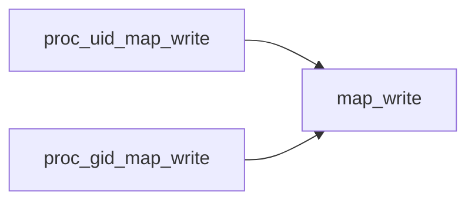
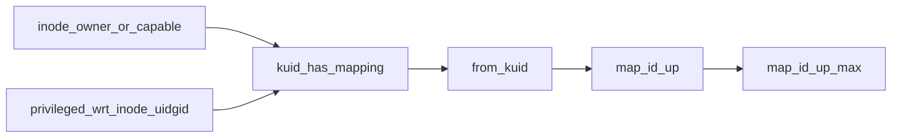

# Linux内核提权漏洞CVE-2018-18955

## 场景介绍

由于在`map_write()`中存在逻辑漏洞，攻击者可以通过构造恶意payload，在一些场景下，绕过权限检查达到root权限的能力。

## 漏洞详情

`map_write()`函数中调用map_id_range_down的for循环中，更新了`e->lower_first`的值，而e是通过forward来找到的，所以说最终只是更新了forward中的值，而**<font color=green>reverse中的值没有被更改</font>**，

所以说这个reverse中的值是用户传进来的，如果先有一个名称空间n1，映射自己的root进程到kernel的普通进程，然后n1再创建一个名称空间n2，而将n1的root权限映射到n2的root权限，这样在n2中的uid_map中，forword指向的uid_gid_extent的第2项被更改了，但是forword指向的没有被更改，还保持root到root的映射，所以**通过这个reverse来判断的uid就会出现权限提升了**。


### 背景知识
#### newuidmap命令
设置`/proc/[pid]/uid_map`，其设置会受到/etc/subuid文件的制约，root用户也不能绕过/etc/subuid的检查。


> newuidmap verifies that the caller is the owner of the process indicated by pid and that for each of the above sets, each of the UIDs in the range `[loweruid, loweruid+count)` is allowed to the caller according to /etc/subuid before setting `/proc/[pid]/uid_map`.


/etc/subuid文件每行包含一个用户名和一个user id的可用范围，文件指示了普通用户在newuidmap命令中，配置user namespace的uid映射，可用的user ID。

## 环境搭建

```
sudo ./metarget cnv install cve-2018-18955 --verbose
```

## 漏洞复现

### 本地提权

```
gcc -o subuid_shell subuid_shell.c
gcc -o subshell subshell.c
```

```
./subuid_shell
./subshell
cat /etc/shadow
```

### 容器提权

**Dockerfile**
```Dockerfile
FROM ubuntu

RUN apt-get update && apt-get install uidmap -y
RUN useradd -u 1001 poc
COPY subshell /
COPY subuid_shell /

USER 1001

CMD /bin/bash
```

poc需要用到newuidmap，所以需要安装uidmap

```
docker build -t pod .
docker run -it --rm --security-opt seccomp=unconfined --cap-add sys_admin poc
```
docker 的 seccomp 配置文件默认过滤了unshare系统调用，同时需要CAP_SYS_ADMIN Capabilities。

**容器中**
```
./subuid_shell
./subshell
cat /etc/shadow
```


## 参考文献
- [CVE-2018-18955：较新Linux内核的提权神洞分析](https://www.freebuf.com/vuls/197122.html)

# 详细版

Linux内核的*6397fac4915a*提交将user namespace映射可能的数量从5增加到了340。操作方法是：当映射的条目数超过5时，会使用一个不同的数据结构。从简单的线性扫描改为二分扫描。

映射总是从两个方向考虑的（kernelID映射到namespaceID，namespaceID映射到kernelID），所以会创建两个副本，并且按照不同的方式进行排序。

`map_write()`中，在调用`insert_extent()`的循环中，

## 用到的数据结构

```c
struct uid_gid_extent{
	u32 first;
	u32 lower_first;
	u32 count;
}
```

```c
struct uid_gid_map{
	u32 nr_extents;
	union{
		struct uid_gid_extent extent[UID_GID_MAP_MAX_BASE_EXTENTS];
		struct{
			struct uid_gid_extent *forward;
			struct uid_gid_extent *reverse;
		};
	};
}
```

lower_first 父ns中的ID

问题，用到了两个排序后的数组，但是代码省略了kernel到namespace的转换，只有namespaced到kernel的映射被恰当的转换了。


首先创建如此的映射
NS1
0 100000 1000

然后在NS1中，创建NS2，使用如下的映射

0 0 1
1 1 1
2 2 1
3 3 1
4 4 1
5 5 995

make_kuid 工作正常

> make_kuid 
> Map a user-namespace uid pair into a kuid

from_kuid 将是0到1000

> from_kuid
> Create a uid from a kuid user-namespace pair


> Most users of from_kuid() are relatively boring, but kuid_has_mapping() is used
in inode_owner_or_capable() and privileged_wrt_inode_uidgid(); so you can abuse
this to gain the ability to override DAC security controls on files whose IDs
aren't mapped in your namespace.

漏洞出现在`/source/kernel/user_namespace.c`的`map_write()`函数，

## 调用链


## 所用到的数据结构

```c
struct uid_gid_extent{
	u32 first;
	u32 lower_first;
	u32 count;
}
```

```c
struct uid_gid_map{
	u32 nr_extents;
	union{
		struct uid_gid_extent extent[UID_GID_MAP_MAX_BASE_EXTENTS];
		struct{
			struct uid_gid_extent *forward;
			struct uid_gid_extent *reverse;
		};
	};
}
```


## `map_write()`函数

map_write()函数的流程：
1. 进行一些检查
2. 读取用户输入，到存到new_map中
3. 调用`sort_idmaps`对forward和reverse进行排序
4. 通过`map_id_range_down`更新lower_first
5. 写回新的map

### insert_extent
第一个大循环中，主要操作就是用户输入中，按照行提取出first lower_first count保存到extent中，然后调用insert_extent向uid_gid_map中插入一个uid_gid_extent。

当行数小于UID_GID_MAP_MAX_BASE_EXTENTS时，数据保存在uid_gid_map里的extent数组中，当行数大于UID_GID_MAP_MAX_BASE_EXTENTS时，数据通过forward指针，保存到动态申请的堆上的数组中。


### sort_idmaps
只有当数量超过UID_GID_MAP_MAX_BASE_EXTENTS时才需要排序

forward是按照新的namespace中uid的大小进行排序

reverse是按照父namespace中uid的大小进行排序

调用了sort函数

sort函数是内核实现的一个实现的一个排序函数

参数：
- base：排序数组指针
- num：元素个数
- size：每个元素的大小
- cmp_func：比较函数
- swap_func：交换函数


### `map_id_range_down()`

当extent的数量大于UID_GID_MAP_MAX_BASE_EXTENTS时，会调用

`map_id_range_down_max`函数，这个函数是一个bsearch的封装，返回的是uid_gid_extent类型的指针

这个函数本身返回值是一个id，实际上就是整个系统中的uid的值。

然后把lower_first修改为其的返回值


#### `map_id_range_down_max()`

```
struct idmap_key{
	bool map_up;
	u32 id;//id to find
	u32 count;
}
```

注意：是在上一层namespace的uid_gid_map里找本层的lower_first

返回了上一层的extent


### 写回

map_write传入的参数map，就是当前namespace中的uid_gid_map，将new_map写回到map中。


## 漏洞点

有一个逻辑上的问题：reverse中的值没有被更改

如果先有一个名称空间n1，映射自己的root进程到kernel的普通进程，然后n1再创建一个名称空间n2，而将n1的root权限映射到n2的root权限，这样在n2中的uid_map中，forword指向的uid_gid_extent的第2项被更改了，但是forword指向的没有被更改，还保持root到root的映射，所以通过这个reverse来判断的uid就会出现权限提升了。

### 哪里会用到reverse？



privileged_wrt_indode_uidgid，检查这个namespace中的Capabilities能否使用到indoe上，**即通过usernamespace中的权限去查看/修改了不属于这个usernamespace**


## EXP
并不是获得了全部的权限，只有利用到了reverse的权限检查是root权限，但是可以

- [x] 读取`/etc/shadow`文件
- [x] 通过执行`echo o > /proc/sysrq-trigger`而关机 


## 注意事项

- 如果用于容器提权
	- 条件1：绕过seccomp文件，由于exp需要创建namespace，进行unshare系统调用
	- 条件2：容器被赋予了CAP_SYS_ADMIN权限
- 只能用于容器内提权：
	- 由于漏洞的机制，没有办法绕过各种namespace的限制