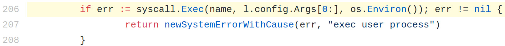
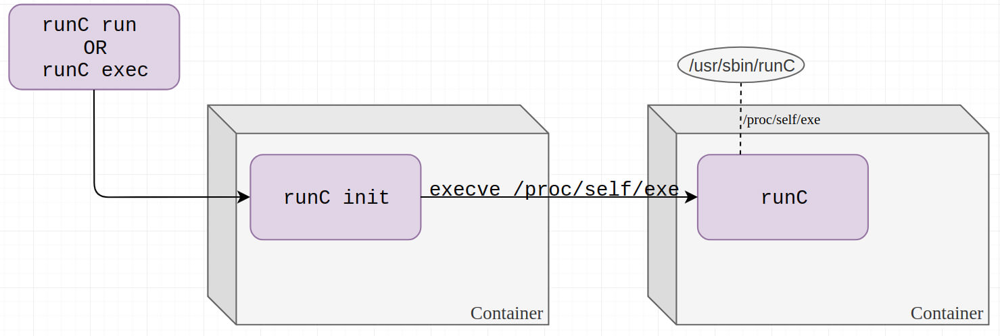
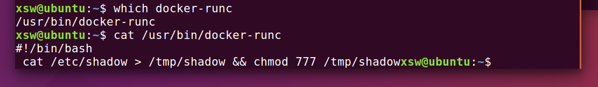
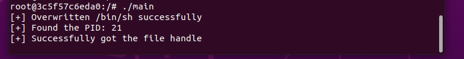

非常著名的容器逃逸漏洞

“The cat was out of the bag.” Cat和bag是双关语

# 漏洞介绍

影响版本：runc 1.0-rc6
Docker版本18.09.2

> runc through 1.0-rc6, as used in Docker before 18.09.2 and other products, allows attackers to overwrite the host runc binary (and consequently obtain host root access) by leveraging the ability to execute a command as root within one of these types of containers: (1) a new container with an attacker-controlled image, or (2) an existing container, to which the attacker previously had write access, that can be attached with docker exec. This occurs because of file-descriptor mishandling, related to /proc/self/exe.

由于Docker的架构，执行`docker exec`命令会执行到`runc exec`。

# 漏洞详情

## 背景知识
### `runc exec`的执行过程
1. runc启动，加入到容器的命名空间中；
2. 以自身(`/proc/[PID]/exe`)启动子进程runC init，进行所有的限制。通过exec syscall执行用户指定的二进制程序；



### `/proc`
1. `/proc/[PID]/exe`：**特殊的**符号链接，指向自身对应的本地程序文件；
2. `/proc/[PID]/fd/`：这个目录下包含了进程打开的所有文件描述符。

### `/proc/[PID]/exe`
一个软链接到正在执行的可执行文件。

打开这个文件在权限通过的情况下，内核将直接返回一个指向该文件的fd，而不是进行路径解析和文件查找。（实际上绕过了mnt命令空间以及chroot对一个进程能够访问到的文件路径的限制）

如果在runc exec加入到容器的命名空间之后，容器内进程已经能够通过内部/proc观察到，此时如果打开`/proc/[runc-pid]/exe`并写入一些内容，能够实现将宿主机上的runc二进制程序覆盖掉。

# 漏洞利用

## 利用思路



令runc执行`/proc/self/exe`，这是一个软链接指向runC在host上的二进制程序。攻击者可以通过覆写`/proc/self/exe`获得host上root访问权限。

`/proc/self/exe`是一个特殊的软链接


## 漏洞利用的限制
1. 需要具有容器内部的root权限；
2. Linux不允许修改正在运行进程对应的本地二进制文件。


1. 将`/bin/sh`程序覆盖为`#!/proc/self/exe`
2. 遍历`/proc`目录，读取每一个`/proc/[PID]/cmdline`，对runc做字符串匹配，直到找到runc进程号
3. 以只读方式打开`/proc/[runc-PID]/exe`，拿到文件描述符fd
4. 持续尝试以写方式打开第3步中获得的只读fd（`/proc/self/fd/[fd]`），一开始总是返回失败，直到runc结束占用后写方式打开成功，立即通过该fd向宿主机上`/usr/bin/runc`（名字也可能是`/usr/bin/docker-runc`）写入攻击载荷；
5. runc最后将执行用户通过`docker exec`指定的`/bin/sh`，它的内容在第1步中已经被替换成`#!/proc/self/exe`，因此实际上将执行宿主机上的runc，而runc也已经在第4部中被我们覆盖掉了。


# 漏洞复现
漏洞复现过程非常容易

### 搭建环境
- 操作系统：Ubuntu 16.04
- Docker：18.06.0-ce
- Runc：1.0.0-rc5+dev

### 下载Poc
https://github.com/Frichetten/CVE-2019-5736-PoC

**编译**：
```shell
go build -o poc main.go
```

**运行**：
将编译好的可执行程序拷贝到容器内，在容器内运行，等待host用户调用`docker exec`，由于可执行程序runc被篡改，会以root权限执行runc内代码。



如图所示：docker-runc可执行程序已经被覆盖为shellcode，在执行docker exec时shellcode会以root权限执行，达到逃逸、任意代码执行以及提权的目的，同时导致了docker exec的拒绝服务。

同样有通过劫持动态链接库进行漏洞利用的方法

# 漏洞修复
目前的修复方法是通过匿名文件的方法，让runc在容器执行操作前先把自身复制成为一个匿名文件，接着执行这个匿名文件。



新版本中漏洞已经被修复，无法成功拿到fd。

## 漏洞缓解

漏洞可以被`Non-Root`容器缓解