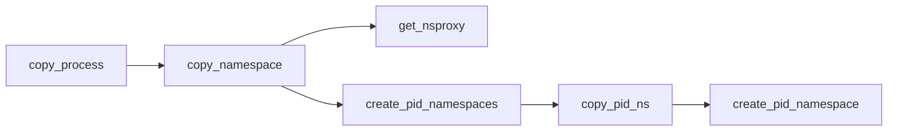

# Mount namespace

- 隔离文件系统的挂载点【怎么理解】
- 相比chroot，mount namespace更加安全与灵活
- `/proc/[pid]/mouts`, `/proc/[pid]/mountinfo`,`/proc/[pid]/mountstats`：所有在相同mount namespace中的进程在这些文件中看到的内容是相同的
- 通过clone创建，子namespace中的mount point list是父namespace的复制
- 通过unshare创建，挂载点列表是调用者之前的mount namespace的复制
- 和`pivot_root`系统调用对容器文件系统的隔离
- 在Mount Namespace中调用`mount()`和`umount()`仅仅只影响当前Namespace内的文件系统

## `pivot_root`

```c
int syscall(SYS_pivot_root, const char *new_root, const char *put_old);
```

改变调用进程所在的mount namespace的root mount。


# User Namespace
[[User namespace]]
User namespace隔离安全相关的描述符以及属性：
- uid/gid：一个进程的uid/gid在username的内外可以不同（namespace外是user用户权限，内是uid=0）
- User namespace可以嵌套，最多32层
- 单线程的进程可以加入到另一个user namespace中，如果其有CAP_SYS_ADMIN权限
- 根目录
- keys
- capabilities：通过clone系统调用`CLONE_NEWUSER`flag创建的子进程会在新的usernamespace中获取所有Capabilities。

- 非root进程可以创建User Namespace
- 用户Namespace里面被映射成root，且在Namespace内有root权限

- 提供对User IDs和Group IDs的隔离
- 实现unprivileged容器【容器外非root用户被映射为容器内root用户】
- User Namespace引入的漏洞
- 与capability的矛盾【也是漏洞多的原因】

可以理解为，给namespace中的uid/gid与宿主机上的uid/gid建立了一个映射关系。

![[Pasted image 20210427165751.png]]

user namespace可以嵌套，最多32层

```
unshare -r #创建一个user namespace，当前用户映射为root用户
```

进程通过setns计入namespace需要在该namespace下拥有CAP_SYS_ADMIN权限，在这之后会获取全部的cap

通过clone with clone_newuser flag会在新的user namespace中获取全部cap，但是执行exec后，会按照正常方式计算Capabilities。

clone with clone_newuser会为子进程设置securebits 位（禁用所有flag），


# IPC Namespace

-  SystemV IPC和POSIX消息队列的namespace化
-  支持的跨进程方式：
	-  共享内存
	-  消息队列
	-  信号量

Docker支持指定IPC namespace

# Network Namespace
- 网络设备的隔离，一般指lo,etho。通过`ip link`
- IPv4和IPv6协议栈
- IP路由表
- 防火墙规则iptables
- 网络状态信息


# PID Namespace
- 提供进程ID的隔离

【源码分析】：
https://zhuanlan.zhihu.com/p/335171876

## 源码分析


```c
struct task_struct {
	... ...
    struct fs_struct *fs;
	struct files_struct *files;
	struct nsproxy *nsproxy;
	... ...
};
```

```c
struct nsproxy {
	atomic_t count;
	struct uts_namespace *uts_ns;
	struct ipc_namespace *ipc_ns;
	struct mnt_namespace *mnt_ns;
	struct pid_namespace *pid_ns_for_children;
	struct net 	     *net_ns;
	struct time_namespace *time_ns;
	struct time_namespace *time_ns_for_children;
	struct cgroup_namespace *cgroup_ns;
};
```

```c
struct pid_namespace {
	struct kref kref;
	struct idr idr;
	struct rcu_head rcu;
	unsigned int pid_allocated;
	struct task_struct *child_reaper;
	struct kmem_cache *pid_cachep;
	unsigned int level;
	struct pid_namespace *parent;
#ifdef CONFIG_BSD_PROCESS_ACCT
	struct fs_pin *bacct;
#endif
	struct user_namespace *user_ns;
	struct ucounts *ucounts;
	int reboot;	/* group exit code if this pidns was rebooted */
	struct ns_common ns;
} __randomize_layout;
```

### init进程的pid namespace

全局变量`init_pid_ns`

```c
/*
 * PID-map pages start out as NULL, they get allocated upon
 * first use and are never deallocated. This way a low pid_max
 * value does not cause lots of bitmaps to be allocated, but
 * the scheme scales to up to 4 million PIDs, runtime.
 */
struct pid_namespace init_pid_ns = {
	.kref = KREF_INIT(2),
	.idr = IDR_INIT(init_pid_ns.idr),
	.pid_allocated = PIDNS_ADDING,
	.level = 0,
	.child_reaper = &init_task,
	.user_ns = &init_user_ns,
	.ns.inum = PROC_PID_INIT_INO,
#ifdef CONFIG_PID_NS
	.ns.ops = &pidns_operations,
#endif
};
EXPORT_SYMBOL_GPL(init_pid_ns);

```

#### init进程的namespace数据

最外层namespace进程task_struct的nsproxy都指向init_nsproxy
```c
struct nsproxy init_nsproxy = {
	.count			= ATOMIC_INIT(1),
	.uts_ns			= &init_uts_ns,
#if defined(CONFIG_POSIX_MQUEUE) || defined(CONFIG_SYSVIPC)
	.ipc_ns			= &init_ipc_ns,
#endif
	.mnt_ns			= NULL,
	.pid_ns_for_children	= &init_pid_ns,//指向了init进程的pid_namespace
#ifdef CONFIG_NET
	.net_ns			= &init_net,
#endif
#ifdef CONFIG_CGROUPS
	.cgroup_ns		= &init_cgroup_ns,
#endif
#ifdef CONFIG_TIME_NS
	.time_ns		= &init_time_ns,
	.time_ns_for_children	= &init_time_ns,
#endif
};
```


### 创建子进程的过程

主要分析的对象



```c
int copy_namespaces(unsigned long flags, struct task_struct *tsk)
{
	struct nsproxy *old_ns = tsk->nsproxy;
	struct user_namespace *user_ns = task_cred_xxx(tsk, user_ns);
	struct nsproxy *new_ns;
	int ret;

	if (likely(!(flags & (CLONE_NEWNS | CLONE_NEWUTS | CLONE_NEWIPC |
			      CLONE_NEWPID | CLONE_NEWNET |
			      CLONE_NEWCGROUP | CLONE_NEWTIME)))) {
		if (likely(old_ns->time_ns_for_children == old_ns->time_ns)) {
			get_nsproxy(old_ns);
			return 0;
		}
	} else if (!ns_capable(user_ns, CAP_SYS_ADMIN))//这里做了权限检查
		return -EPERM;

	/*
	 * CLONE_NEWIPC must detach from the undolist: after switching
	 * to a new ipc namespace, the semaphore arrays from the old
	 * namespace are unreachable.  In clone parlance, CLONE_SYSVSEM
	 * means share undolist with parent, so we must forbid using
	 * it along with CLONE_NEWIPC.
	 */
	if ((flags & (CLONE_NEWIPC | CLONE_SYSVSEM)) ==
		(CLONE_NEWIPC | CLONE_SYSVSEM)) 
		return -EINVAL;

	new_ns = create_new_namespaces(flags, tsk, user_ns, tsk->fs);
	if (IS_ERR(new_ns))
		return  PTR_ERR(new_ns);

	ret = timens_on_fork(new_ns, tsk);
	if (ret) {
		free_nsproxy(new_ns);
		return ret;
	}

	tsk->nsproxy = new_ns;
	return 0;
}
```
- 如果没有标记则继承父进程的namespace（调用get_nsproxy，引用计数+1）
- 如果有则调用create_new_namespaces

```c
/*
 * Create new nsproxy and all of its the associated namespaces.
 * Return the newly created nsproxy.  Do not attach this to the task,
 * leave it to the caller to do proper locking and attach it to task.
 */
static struct nsproxy *create_new_namespaces(unsigned long flags,
	struct task_struct *tsk, struct user_namespace *user_ns,
	struct fs_struct *new_fs)
{
	struct nsproxy *new_nsp;
	int err;

	new_nsp = create_nsproxy();
	if (!new_nsp)
		return ERR_PTR(-ENOMEM);

	new_nsp->mnt_ns = copy_mnt_ns(flags, tsk->nsproxy->mnt_ns, user_ns, new_fs);
	if (IS_ERR(new_nsp->mnt_ns)) {
		err = PTR_ERR(new_nsp->mnt_ns);
		goto out_ns;
	}

	new_nsp->uts_ns = copy_utsname(flags, user_ns, tsk->nsproxy->uts_ns);
	if (IS_ERR(new_nsp->uts_ns)) {
		err = PTR_ERR(new_nsp->uts_ns);
		goto out_uts;
	}

	new_nsp->ipc_ns = copy_ipcs(flags, user_ns, tsk->nsproxy->ipc_ns);
	if (IS_ERR(new_nsp->ipc_ns)) {
		err = PTR_ERR(new_nsp->ipc_ns);
		goto out_ipc;
	}

	new_nsp->pid_ns_for_children =
		copy_pid_ns(flags, user_ns, tsk->nsproxy->pid_ns_for_children);
	if (IS_ERR(new_nsp->pid_ns_for_children)) {
		err = PTR_ERR(new_nsp->pid_ns_for_children);
		goto out_pid;
	}

	new_nsp->cgroup_ns = copy_cgroup_ns(flags, user_ns,
					    tsk->nsproxy->cgroup_ns);
	if (IS_ERR(new_nsp->cgroup_ns)) {
		err = PTR_ERR(new_nsp->cgroup_ns);
		goto out_cgroup;
	}

	new_nsp->net_ns = copy_net_ns(flags, user_ns, tsk->nsproxy->net_ns);
	if (IS_ERR(new_nsp->net_ns)) {
		err = PTR_ERR(new_nsp->net_ns);
		goto out_net;
	}

	new_nsp->time_ns_for_children = copy_time_ns(flags, user_ns,
					tsk->nsproxy->time_ns_for_children);
	if (IS_ERR(new_nsp->time_ns_for_children)) {
		err = PTR_ERR(new_nsp->time_ns_for_children);
		goto out_time;
	}
	new_nsp->time_ns = get_time_ns(tsk->nsproxy->time_ns);

	return new_nsp;

out_time:
	put_net(new_nsp->net_ns);
out_net:
	put_cgroup_ns(new_nsp->cgroup_ns);
out_cgroup:
	if (new_nsp->pid_ns_for_children)
		put_pid_ns(new_nsp->pid_ns_for_children);
out_pid:
	if (new_nsp->ipc_ns)
		put_ipc_ns(new_nsp->ipc_ns);
out_ipc:
	if (new_nsp->uts_ns)
		put_uts_ns(new_nsp->uts_ns);
out_uts:
	if (new_nsp->mnt_ns)
		put_mnt_ns(new_nsp->mnt_ns);
out_ns:
	kmem_cache_free(nsproxy_cachep, new_nsp);
	return ERR_PTR(err);
}

```
- 调用`create_nsproxy`创建一个nsproxy结构体
- `copy_pid_ns`直接调用了`create_pid_namespace`


```c
static struct pid_namespace *create_pid_namespace(struct user_namespace *user_ns,
	struct pid_namespace *parent_pid_ns)
{
	struct pid_namespace *ns;
	unsigned int level = parent_pid_ns->level + 1;
	struct ucounts *ucounts;
	int err;

	err = -EINVAL;
	if (!in_userns(parent_pid_ns->user_ns, user_ns))
		goto out;

	err = -ENOSPC;
	if (level > MAX_PID_NS_LEVEL)
		goto out;
	ucounts = inc_pid_namespaces(user_ns);
	if (!ucounts)
		goto out;

	err = -ENOMEM;
	ns = kmem_cache_zalloc(pid_ns_cachep, GFP_KERNEL);//这里分配了内存
	if (ns == NULL)
		goto out_dec;

	idr_init(&ns->idr);

	ns->pid_cachep = create_pid_cachep(level);
	if (ns->pid_cachep == NULL)
		goto out_free_idr;

	err = ns_alloc_inum(&ns->ns);
	if (err)
		goto out_free_idr;
	ns->ns.ops = &pidns_operations;

	kref_init(&ns->kref);
	ns->level = level;
	ns->parent = get_pid_ns(parent_pid_ns);
	ns->user_ns = get_user_ns(user_ns);
	ns->ucounts = ucounts;
	ns->pid_allocated = PIDNS_ADDING;

	return ns;

out_free_idr:
	idr_destroy(&ns->idr);
	kmem_cache_free(pid_ns_cachep, ns);
out_dec:
	dec_pid_namespaces(ucounts);
out:
	return ERR_PTR(err);
}
```
- 申请内存
- 在树中的level+1
- 增加user namespace中的引用计数
- 将pid_namespace结构体中的各个域填充好


### 创建子进程pid

```c
struct upid {
	int nr;//该层pid ns的pid值
	struct pid_namespace *ns;
};

struct pid
{
	refcount_t count;
	unsigned int level;
	spinlock_t lock;
	/* lists of tasks that use this pid */
	struct hlist_head tasks[PIDTYPE_MAX];
	struct hlist_head inodes;
	/* wait queue for pidfd notifications */
	wait_queue_head_t wait_pidfd;
	struct rcu_head rcu;
	struct upid numbers[1];
};
```
- `level`：该进程所属的pid_ns的level，表示这个pid对象在多少个pid namespace中可见；
- `numbers`：存储每层的pid信息的变长数组，长度就是上面的level

copy_process中，通过alloc_pid为子进程申请一个`struct pid`
```c
//copy_process()	
if (pid != &init_struct_pid) { //pid指针是函数入参，普通进程创建时调用的__do_fork中该参数为NULL
		pid = alloc_pid(p->nsproxy->pid_ns_for_children);
		if (IS_ERR(pid)) {
			retval = PTR_ERR(pid);
			goto bad_fork_cleanup_thread;
		}
	}
```
- 调用`alloc_pid`

```c
struct pid *alloc_pid(struct pid_namespace *ns, pid_t *set_tid,
		      size_t set_tid_size)
{
	struct pid *pid;
	enum pid_type type;
	int i, nr;
	struct pid_namespace *tmp;
	struct upid *upid;
	int retval = -ENOMEM;

	/*
	 * set_tid_size contains the size of the set_tid array. Starting at
	 * the most nested currently active PID namespace it tells alloc_pid()
	 * which PID to set for a process in that most nested PID namespace
	 * up to set_tid_size PID namespaces. It does not have to set the PID
	 * for a process in all nested PID namespaces but set_tid_size must
	 * never be greater than the current ns->level + 1.
	 */
	if (set_tid_size > ns->level + 1)
		return ERR_PTR(-EINVAL);

	pid = kmem_cache_alloc(ns->pid_cachep, GFP_KERNEL);
	if (!pid)
		return ERR_PTR(retval);

	tmp = ns;
	pid->level = ns->level;//pid成员记录新进程的pid_ns的level，即进程ns的编号

	for (i = ns->level; i >= 0; i--) {//遍历所有父pid_ns, pid结构体内需要记录每层pid_ns分配的pid值
		int tid = 0;

		if (set_tid_size) {
			tid = set_tid[ns->level - i];

			retval = -EINVAL;
			if (tid < 1 || tid >= pid_max)
				goto out_free;
			/*
			 * Also fail if a PID != 1 is requested and
			 * no PID 1 exists.
			 */
			if (tid != 1 && !tmp->child_reaper)
				goto out_free;
			retval = -EPERM;
			if (!ns_capable(tmp->user_ns, CAP_SYS_ADMIN))
				goto out_free;
			set_tid_size--;
		}

		idr_preload(GFP_KERNEL);
		spin_lock_irq(&pidmap_lock);

		if (tid) {
			nr = idr_alloc(&tmp->idr, NULL, tid,
				       tid + 1, GFP_ATOMIC);
			/*
			 * If ENOSPC is returned it means that the PID is
			 * alreay in use. Return EEXIST in that case.
			 */
			if (nr == -ENOSPC)
				nr = -EEXIST;
		} else {
			int pid_min = 1;
			/*
			 * init really needs pid 1, but after reaching the
			 * maximum wrap back to RESERVED_PIDS
			 */
			if (idr_get_cursor(&tmp->idr) > RESERVED_PIDS)
				pid_min = RESERVED_PIDS;

			/*
			 * Store a null pointer so find_pid_ns does not find
			 * a partially initialized PID (see below).
			 */
			nr = idr_alloc_cyclic(&tmp->idr, NULL, pid_min,
					      pid_max, GFP_ATOMIC);
		}
		spin_unlock_irq(&pidmap_lock);
		idr_preload_end();

		if (nr < 0) {
			retval = (nr == -ENOSPC) ? -EAGAIN : nr;
			goto out_free;
		}

		pid->numbers[i].nr = nr;
		pid->numbers[i].ns = tmp;
		tmp = tmp->parent;
	}

	/*
	 * ENOMEM is not the most obvious choice especially for the case
	 * where the child subreaper has already exited and the pid
	 * namespace denies the creation of any new processes. But ENOMEM
	 * is what we have exposed to userspace for a long time and it is
	 * documented behavior for pid namespaces. So we can't easily
	 * change it even if there were an error code better suited.
	 */
	retval = -ENOMEM;

	get_pid_ns(ns);
	refcount_set(&pid->count, 1);
	spin_lock_init(&pid->lock);
	for (type = 0; type < PIDTYPE_MAX; ++type)
		INIT_HLIST_HEAD(&pid->tasks[type]);

	init_waitqueue_head(&pid->wait_pidfd);
	INIT_HLIST_HEAD(&pid->inodes);

	upid = pid->numbers + ns->level;
	spin_lock_irq(&pidmap_lock);
	if (!(ns->pid_allocated & PIDNS_ADDING))
		goto out_unlock;
	for ( ; upid >= pid->numbers; --upid) {
		/* Make the PID visible to find_pid_ns. */
		idr_replace(&upid->ns->idr, pid, upid->nr);
		upid->ns->pid_allocated++;
	}
	spin_unlock_irq(&pidmap_lock);

	return pid;

out_unlock:
	spin_unlock_irq(&pidmap_lock);
	put_pid_ns(ns);

out_free:
	spin_lock_irq(&pidmap_lock);
	while (++i <= ns->level) {
		upid = pid->numbers + i;
		idr_remove(&upid->ns->idr, upid->nr);
	}

	/* On failure to allocate the first pid, reset the state */
	if (ns->pid_allocated == PIDNS_ADDING)
		idr_set_cursor(&ns->idr, 0);

	spin_unlock_irq(&pidmap_lock);

	kmem_cache_free(ns->pid_cachep, pid);
	return ERR_PTR(retval);
}
```

- 在循环内：不断调用idr_alloc找到当前namespace下空闲的nr号
	- `idr_alloc`机制：在redis数上分配一个整形和指针变量的对，指针指向节点
	- 相当于遍历了pid namespace树，树上的每个节点都分配了一次nr即pid


### 保存进程ID信息

```c
//in copy_process func：
	p->pid = pid_nr(pid);   //获取global pid_ns中的pid，即第0层
        … …
        init_task_pid(p, PIDTYPE_PID, pid);   //将struct pid 结构地址保存到进程描述符中
```


```c
static inline void
init_task_pid(struct task_struct *task, enum pid_type type, struct pid *pid)
{
	if (type == PIDTYPE_PID)
		task->thread_pid = pid;
	else
		task->signal->pids[type] = pid;
}
```

一些相关的数据结构

1. task_struct中的域
```c
struct task_struct
{
        … …
	struct pid_link		pids[PIDTYPE_MAX];
        … …
}
```

2. PIDTYPE_MAX的枚举

```c
enum pid_type
{
	PIDTYPE_PID,
	PIDTYPE_PGID,
	PIDTYPE_SID,
	PIDTYPE_MAX,
	/* only valid to __task_pid_nr_ns() */
	__PIDTYPE_TGID
};
```

3. pid_link结构体
```c
struct pid_link
{
	struct hlist_node node;
	struct pid *pid;
};
```

注意：Linux不区分进程和线程，为了既能方便从task struct快速找到对应的struct pid，又能方便从struct pid能够遍历所有使用该pid的task，内核设计了 struct pid_link 来保存各个ID对应的struct pid 结构地址。

### 获取进程的PID value

Linux内核提供三个标准API以获取进程PID value

1. pid_nr()
获取最外层的pid
```c
static inline pid_t pid_nr(struct pid *pid)
{
	pid_t nr = 0;
	if (pid)
		nr = pid->numbers[0].nr;
	return nr;
}
```


2. pid_vnr()
获取当前pid namespace的pid
```c
pid_t pid_vnr(struct pid *pid)
{
	return pid_nr_ns(pid, task_active_pid_ns(current));
}
EXPORT_SYMBOL_GPL(pid_vnr);
```

3. pid_nr_ns()
获取指定namespace中的pid value

```c
pid_t pid_nr_ns(struct pid *pid, struct pid_namespace *ns)
{
	struct upid *upid;
	pid_t nr = 0;

	if (pid && ns->level <= pid->level) {
		upid = &pid->numbers[ns->level];
		if (upid->ns == ns)
			nr = upid->nr;
	}
	return nr;
}
EXPORT_SYMBOL_GPL(pid_nr_ns);
```
- level的存在方便了很多

#### 用户空间调用getpid

```c
SYSCALL_DEFINE0(getpid)
{
	return task_tgid_vnr(current);
}
static inline pid_t task_tgid_vnr(struct task_struct *tsk)
{
	return __task_pid_nr_ns(tsk, __PIDTYPE_TGID, NULL);
}
pid_t __task_pid_nr_ns(struct task_struct *task, enum pid_type type,
	struct pid_namespace *ns)
{
	if (!ns)
		ns = task_active_pid_ns(current);
        … …
	nr = pid_nr_ns(rcu_dereference(task->pids[type].pid), ns);
	}
	rcu_read_unlock();

	return nr;
}
```
最终调用的是`pid_nr_ns`，返回的是当前namespace中的pid，也就是vpid

### 根据pid获取pid_namespace

```c
static inline struct pid_namespace *ns_of_pid(struct pid *pid)
{
	struct pid_namespace *ns = NULL;
	if (pid)
		ns = pid->numbers[pid->level].ns;
	return ns;
}
```
ns_of_pid可以根据pid获取pid_namespace，都是数据结构的相互引用

https://zhuanlan.zhihu.com/p/335171876
# UTS Namespace
- 将系统描述符namespace化

## 文件系统上的体现

/proc/[pid]/ns/


# CGroup Namespace

虚拟化进程对于cgroup的视角

- 每个cgroup namespace拥有其自己的cgroup根目录，即为`/proc/[pid]/cgroup`文件中相对地址的基础点
- 当通过`clone`和`unshare`创建cgroup ns时，当前的cgroup目录会成为新ns中的cgroup根目录
- `/proc/[pid]/cgroup`中pathname展示了对应cgroup下的相对路径
- 如果cgroup目录在根目录之外，pathname会显示../
- 


# API
## 系统调用接口
### clone
### setns
### unshare

## 命令行接口
nsenter